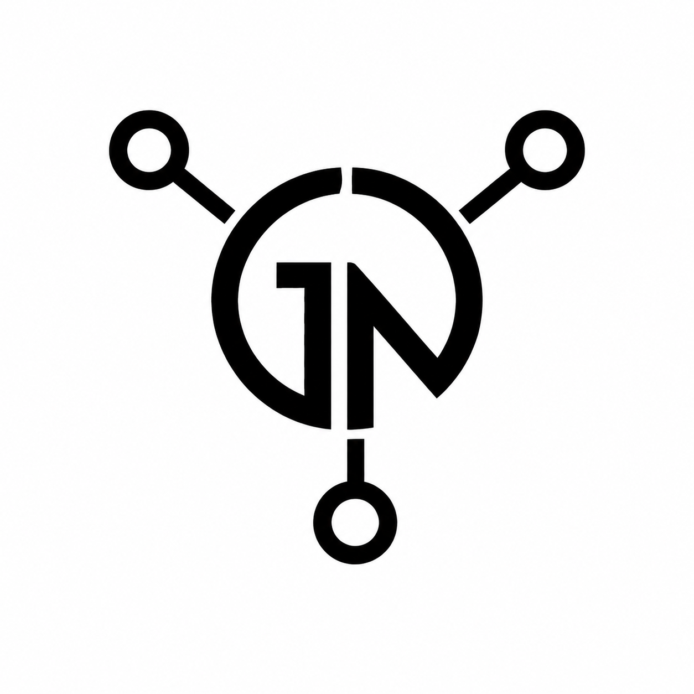
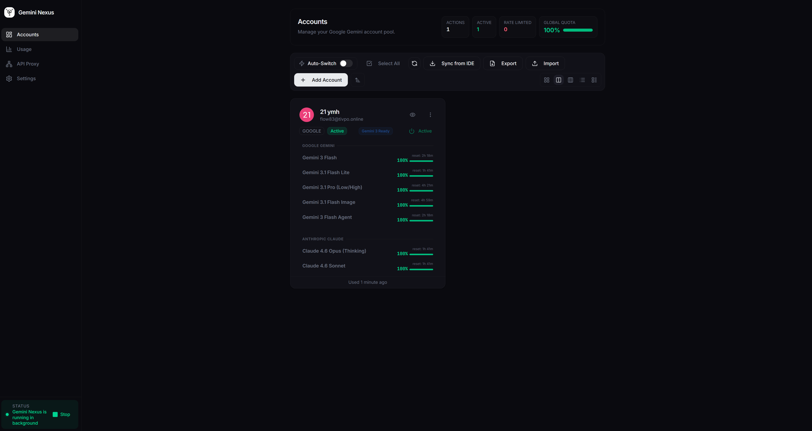
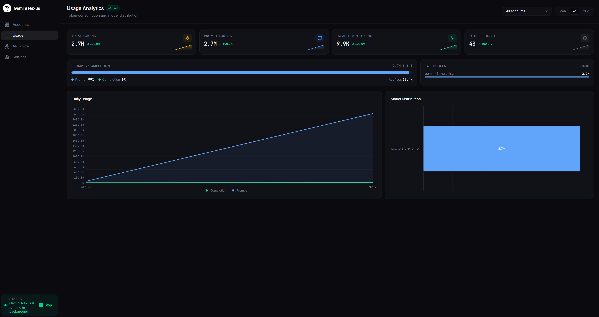
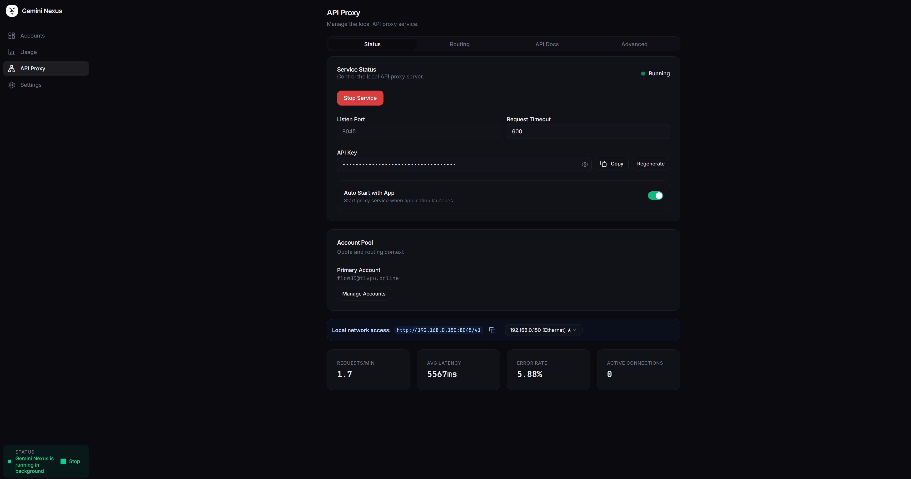
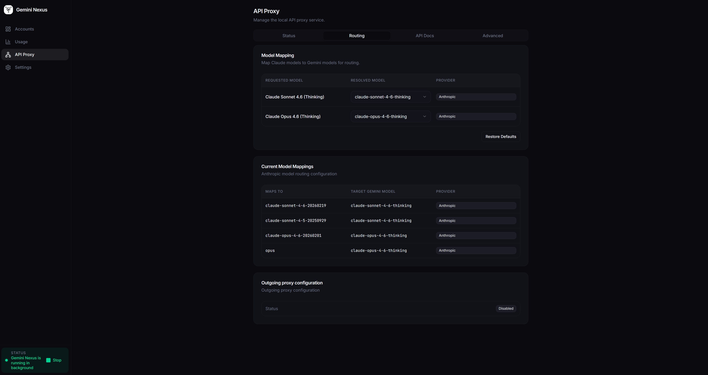
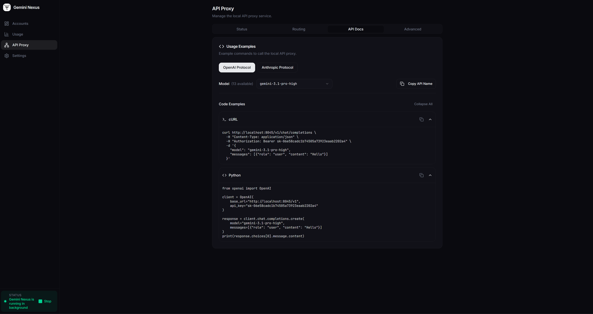
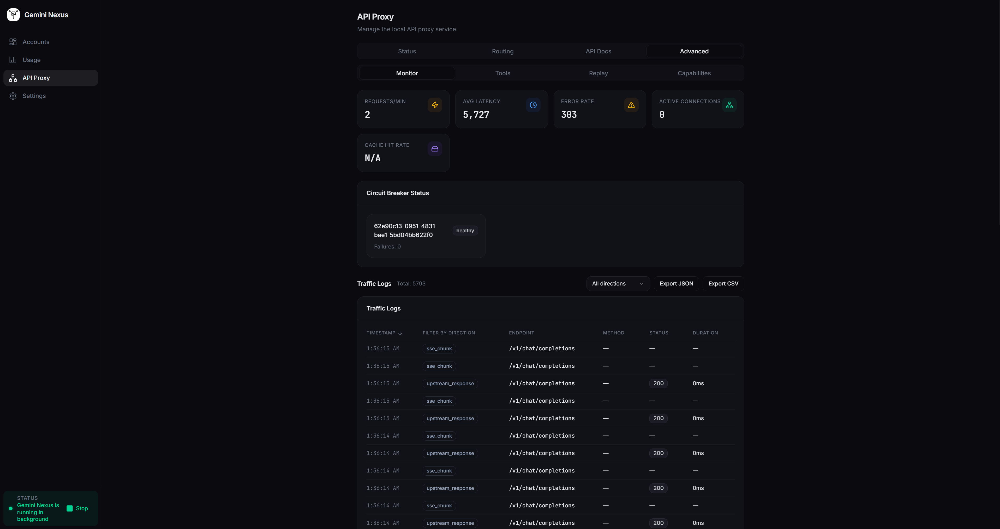
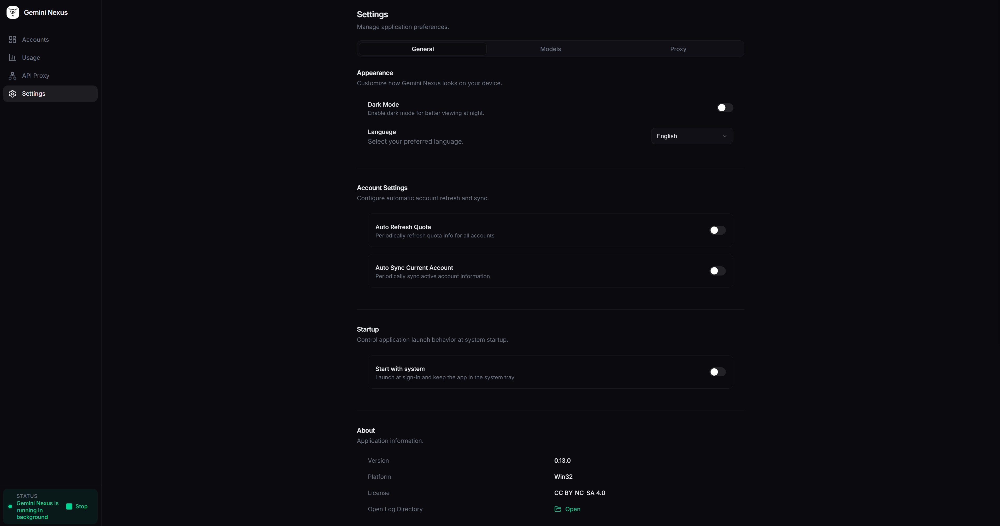

<p align="center">
  
</p>

<h1 align="center">Gemini Nexus</h1>

<p align="center">
  <strong>Desktop gateway that pools several Google Gemini and Claude accounts behind a single local OpenAI- and Anthropic-compatible API.</strong>
</p>

<p align="center">
  English | <a href="README.pt-BR.md">Português</a> | <a href="README.zh-CN.md">中文</a> | <a href="README.es.md">Español</a>
</p>

<p align="center">
  <a href="https://github.com/evandrodevbr/GeminiNexus/releases"></a>
  <a href="https://github.com/evandrodevbr/GeminiNexus/actions/workflows/testing.yaml"></a>
  
  
  
  
  
</p>

> **Windows users:** the installers are not code-signed, so SmartScreen may show "Windows protected your PC". Choose "More info" and then "Run anyway"; this is the expected prompt for an unsigned application.

## About

AI coding tools assume a single account with a single quota. When that quota runs out, you have to switch accounts by hand, and you usually have no idea how many tokens you burned.

Gemini Nexus is an Electron desktop application that runs a local gateway (an embedded NestJS server) in front of a pool of Google Gemini and Claude accounts. Your IDE points at the local gateway once; the gateway picks an account, translates the protocol, retries on quota or rate-limit errors, and records usage.

What it does:

- Manages a pool of Google/Claude accounts with per-account status (active, rate limited, expired) and quota snapshots.
- Serves an OpenAI-compatible surface (`/v1/chat/completions`, `/v1/models`, `/v1/completions`, `/v1/responses`, images and audio routes), an Anthropic-compatible surface (`/v1/messages`) and the Gemini-native surface (`/v1beta/models`, `countTokens`).
- Streams responses over SSE and maps model names in both directions (for example `claude-sonnet-4-5` to the configured Gemini/Claude target).
- Stores tokens and keys encrypted at rest (AES-256-GCM) with an OS keychain wrapper, falling back to a local key file.
- Shows local analytics: token usage, cost estimates, model distribution, request traffic and request replay.

It is a personal desktop tool, not a hosted service: everything runs on your machine.

## How it works

```text
 IDE / CLI (Cursor, Windsurf, OpenCode, Claude Code, custom scripts)
        |  OpenAI /v1/chat/completions   Anthropic /v1/messages   Gemini /v1beta
        v
 Gemini Nexus (Electron app)
   +-- Renderer: React 19 UI (accounts, usage, proxy, settings)
   +-- Main process: IPC, SQLite storage, encryption, tray
   +-- Gateway: NestJS + Fastify, bound to port 8045 (8046 in development)
          |  1. authenticate the request (Bearer / x-api-key / x-goog-api-key)
          |  2. choose an account from the pool (quota, rate limit, circuit breaker)
          |  3. translate the protocol and call the upstream API
          |  4. stream the answer back and persist usage metrics
          v
 Google Gemini API / Claude API (per-account OAuth credentials)
```

- The gateway is started by the desktop app (Proxy page, or auto-start if enabled). It is a child process, so closing the app stops it.
- Account selection honours a scheduling mode (`balance`, `cache-first`, `performance-first`), a preferred account, per-account upstream proxy URLs, and a circuit breaker with backoff steps.
- Requests are recorded locally (SQLite) and can be replayed from the Proxy page for debugging.

## Stack

| Layer | Choice |
|---|---|
| Desktop shell | Electron 41, Electron Forge 7 (Vite plugin) |
| UI | React 19, TypeScript 5.9, TanStack Router + Query, Tailwind CSS v4, Radix UI, Nivo charts |
| Gateway | NestJS 11 on Fastify 5, RxJS, SSE streaming |
| Storage | better-sqlite3 + Drizzle ORM / raw SQL, JSON config in the app data dir |
| Secrets | Node crypto AES-256-GCM, `safeStorage` / `keytar` with file fallback |
| Validation | Zod schemas, class-validator |
| Internationalization | react-i18next (en, zh-CN, ru, vi) |
| Tests | Vitest (unit), Testing Library, Playwright (E2E, local only) |
| Package manager | pnpm 10.11.0 (`packageManager` field, Corepack) |

## Requirements

- Node.js `^20.19.0 || >=22.12.0` (Vite 8 engine range). The repository pins 22.17.1 in `.nvmrc`; this audit ran on Node 24.20.0.
- pnpm `10.11.0` (declared in `package.json`). With Corepack enabled, `pnpm` resolves to that version automatically.
- Native build toolchain for `better-sqlite3` and `keytar`: on Linux, `base-devel`/`build-essential`, `python3` and `libsecret`; on macOS, Xcode Command Line Tools; on Windows, Visual Studio Build Tools with the C++ workload. `pnpm install` runs `scripts/setup-dev.js --check-only`, which reports what is missing.
- A graphical session to run the desktop app itself (Electron).
- For installers: `dpkg`/`rpmbuild` on Linux, WiX Toolset on Windows.

## Quick start

```bash
git clone https://github.com/evandrodevbr/GeminiNexus.git
cd GeminiNexus

# 1. install dependencies (lockfile is pnpm; do not use npm install)
corepack enable
pnpm install --frozen-lockfile

# 2. run the desktop app (Electron + Vite HMR); the gateway listens on 8046 in dev
pnpm start
```

Then, in the app:

1. Add at least one Google or Claude account on the Accounts page (OAuth flow).
2. Open the Proxy page, enable the gateway and copy the generated API key.
3. Point your IDE or CLI at the local endpoint.

```text
API base URL:  http://localhost:8045/v1
API key:       copied from the Proxy page
Model:         gemini-3-flash (or any model id returned by GET /v1/models)
```

## Usage

Daily commands, all driven by `pnpm`:

```bash
pnpm start             # dev app + gateway (port 8046)
pnpm run package       # unpack the app for the current platform (out/)
pnpm run make          # build installers (needs the extra tooling listed above)
pnpm test              # Vitest unit/integration suite
pnpm run type-check    # tsc --noEmit
pnpm run lint          # ESLint
pnpm run format        # Prettier check (pnpm run format:write to fix)
pnpm run test:e2e      # Playwright E2E, needs a graphical session
```

Settings live in the app data directory (`%APPDATA%\Gemini Nexus` on Windows, `~/Library/Application Support/Gemini Nexus` on macOS, `~/.config/Gemini Nexus` on Linux; `${app}-dev` names in development). Account metadata is stored in `~/.geminiNexus-agent/geminiNexus_accounts.json`.

## Screenshots

| | |
|---|---|
|  |  |
|  |  |
|  |  |
|  | |

## API

Routes actually mapped by the gateway (read from the running server):

| Route | Purpose |
|---|---|
| `GET /v1/models` | OpenAI-style model list built from the built-in mapping plus models collected from accounts. |
| `GET /v1/models/capabilities` | Per-model flags: vision, streaming, JSON mode, audio, image generation. |
| `GET /v1/status` | Gateway health, uptime, account counters and request metrics. |
| `POST /v1/chat/completions` | OpenAI Chat Completions, streaming and non-streaming. |
| `POST /v1/completions` | Legacy completions compatibility endpoint. |
| `POST /v1/responses` | OpenAI Responses-style endpoint. |
| `POST /v1/messages` | Anthropic Messages API. |
| `POST /v1/messages/chat/completions` | Anthropic-shaped requests over the chat completions path. |
| `POST /v1/batch/completions` | Batched chat completion requests. |
| `POST /v1/images/generations`, `POST /v1/images/edits` | Image endpoints. |
| `POST /v1/audio/transcriptions` | Audio transcription endpoint. |
| `GET /v1/events` | Server-sent events stream of gateway activity. |
| `GET /v1/replay/requests`, `POST /v1/replay/:requestId` | List recorded requests and replay one of them. |
| `GET /v1beta/models`, `GET /v1beta/models/:model` | Gemini-native model listing. |
| `POST /v1beta/models/:modelAction`, `POST /v1beta/models/:model/countTokens` | Gemini-native generate and token counting. |

Authentication: the gateway accepts the API key as `Authorization: Bearer <key>`, `x-api-key: <key>` or `x-goog-api-key: <key>`. If the configured key is empty, the gateway runs open, which is only sensible while it is bound to localhost.

## Build and release

```bash
pnpm run package   # app bundle in out/<product>-<platform>-<arch>
pnpm run make      # installers (deb, rpm, AppImage, zip on Linux; dmg/zip on macOS; WiX installer on Windows)
pnpm run make:win  # Windows helper script
```

The gateway is statically bundled into the Electron app; there is no separate server deployment.

Release automation in `.github/workflows/`:

- `format.yaml` and `lint.yaml` run Prettier and ESLint on pull requests to `main`.
- `testing.yaml` runs the unit suite and `tsc --noEmit` on pushes and pull requests. E2E is intentionally excluded because it needs a graphical environment.
- `release.yml` runs semantic-release on `main`, which tags the version, updates `CHANGELOG.md` and creates the GitHub release.
- `publish.yaml` builds `win32`, `darwin` and `linux` for x64 and arm64 when the Release workflow succeeds, and uploads the installers to the release.

## Project structure

```text
src/
├── main.ts, preload.ts, renderer.ts   Electron entry points
├── routes/                            TanStack Router pages: index (accounts), usage, proxy, settings
├── components/                        React UI (accounts, proxy/advanced, usage, ui primitives)
├── server/                            Embedded gateway
│   ├── main.ts                        NestJS bootstrap (port and process lifecycle)
│   ├── modules/proxy/                 controllers, proxy service, token manager, SSE, replay, metrics
│   └── modules/usage/                 token usage service
├── ipc/                               Electron IPC handlers (accounts, config, database, proxy, tray, ...)
├── lib/geminiNexus/                   protocol mappers, model mapping, retry and streaming helpers
├── localization/                      i18n resources
├── utils/                             paths, logging, encryption, traffic logger
└── tests/                             unit, integration and e2e suites
docs/                                  OpenCode integration, cloud features, Proxyman guides, brand notes
scripts/                               dev environment setup, Windows build helper, asset generation
```

## Verification

What exists and what was run on Linux x64 (Node 24.20.0, pnpm 10.11.0):

| Command | Result |
|---|---|
| `pnpm install --frozen-lockfile` | exit 0 |
| `pnpm test` | 54 test files, 499 tests, all passing |
| `pnpm run type-check` | exit 0 |
| `pnpm run lint` | exit 0 (327 warnings, no errors) |
| `pnpm run format` | all files formatted |
| `pnpm run package` | exit 0, `out/Gemini Nexus-linux-x64` |
| `pnpm run test:e2e` | not run: Playwright drives Electron and needs a graphical session |

The E2E suite is also excluded from CI for the same reason.

## Current state and limitations

- Upstream calls cannot be exercised without real Google/Claude accounts. With an empty pool the gateway starts, lists models and answers `429 No available accounts (all exhausted or rate limited)` on inference routes.
- The app is desktop-only (Windows, macOS, Linux). There is no headless or container mode, because the gateway is a child process of the Electron app.
- Accounts are added through the app UI and the OAuth flow; there is no CLI to import credentials.
- UI languages are en, zh-CN, ru and vi. The default language in `DEFAULT_APP_CONFIG` is `zh-CN`.
- Windows installers are unsigned (SmartScreen warning). macOS builds are unsigned and unnotarized.
- The E2E suite does not run in CI.
- The project is mid-migration to a single license: the code inherited from AntigravityManager is CC BY-NC-SA 4.0 (non-commercial), while the new code is MIT. See the license section.
- `pnpm install` reports `Ignored build scripts: sharp`. `sharp` is only used by `scripts/generate-assets.ts` for icon generation, and its prebuilt binaries are installed through optional dependencies.

## Documentation

| Document | Content |
|---|---|
| [`docs/OpencodeAPI.md`](docs/OpencodeAPI.md) | Wiring OpenCode to the local custom endpoint |
| [`docs/cloud_features.md`](docs/cloud_features.md) | Cloud account management and switching behaviour |
| [`docs/proxyman-debugging.md`](docs/proxyman-debugging.md) | Debugging upstream traffic with Proxyman |
| [`docs/proxyman-install.md`](docs/proxyman-install.md) | Proxyman setup for contributors |
| [`docs/brand-briefing.md`](docs/brand-briefing.md) | Naming, positioning and visual notes |
| [`CONTRIBUTING.md`](CONTRIBUTING.md), [`AGENTS.md`](AGENTS.md) | Contribution rules and repository conventions |
| [`CHANGELOG.md`](CHANGELOG.md) | Release history |

## License

Dual license:

- Original code from [AntigravityManager](https://github.com/Draculabo/AntigravityManager) by [Draculabo](https://github.com/Draculabo): [CC BY-NC-SA 4.0](LICENSE).
- All new code, features and architecture by [evandrodevbr](https://github.com/evandrodevbr): [MIT](LICENSE-MIT).

The project is being migrated to MIT as the remaining original code is rewritten.

## Credits

Originally forked from [AntigravityManager](https://github.com/Draculabo/AntigravityManager). Since the fork the codebase has been largely rewritten by [evandrodevbr](https://github.com/evandrodevbr): UI/UX, usage analytics, traffic monitor, environment isolation, CI/CD, test infrastructure and documentation.
