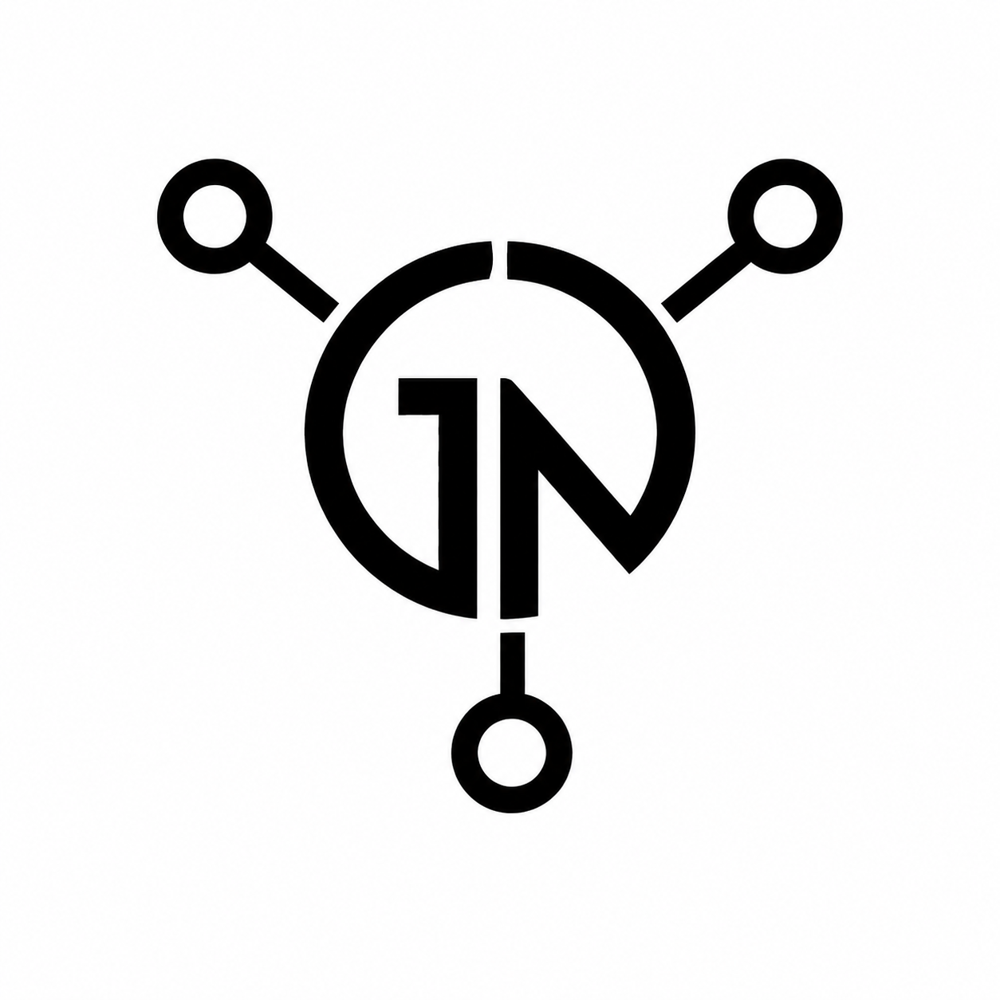
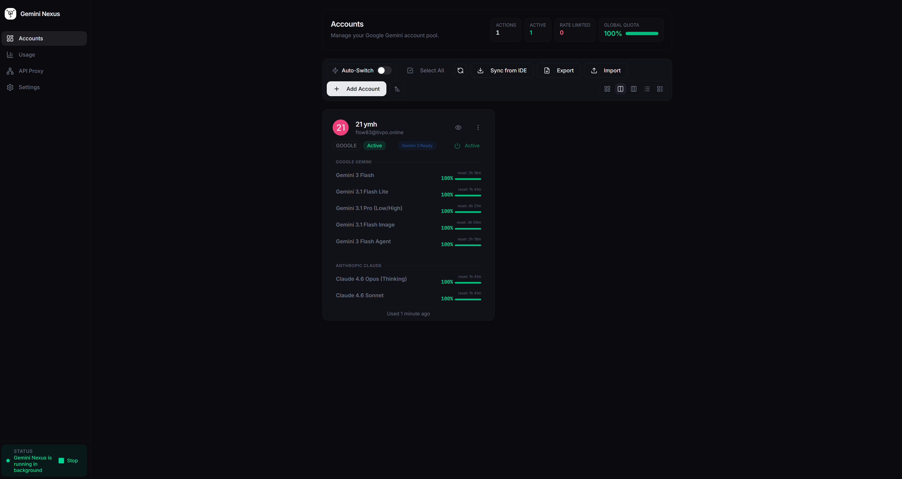
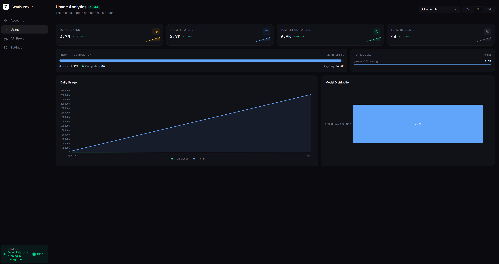
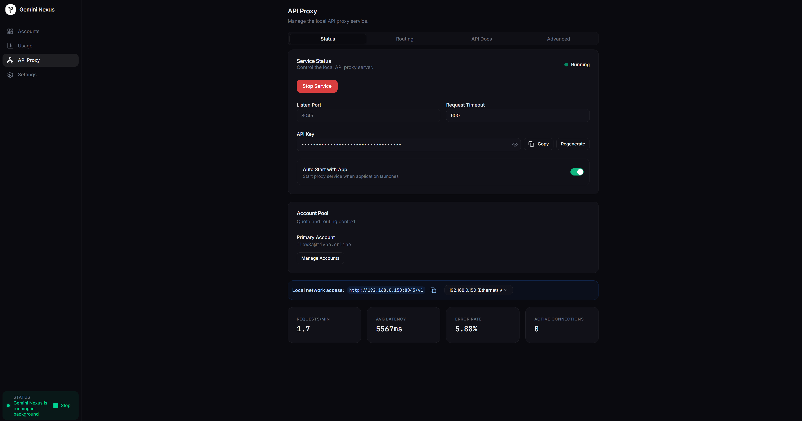
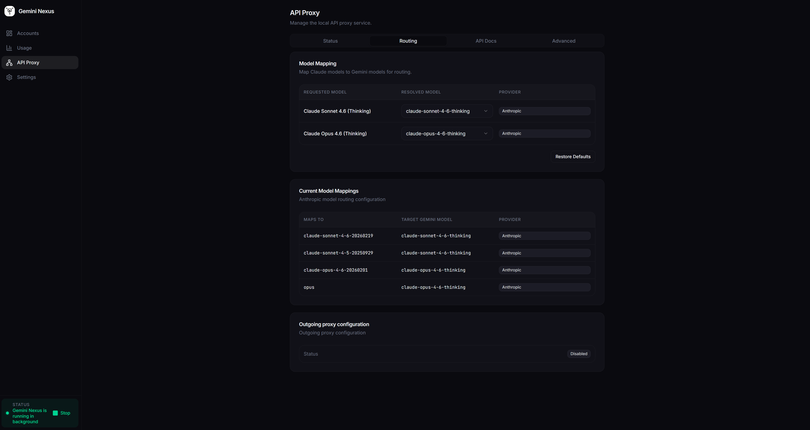
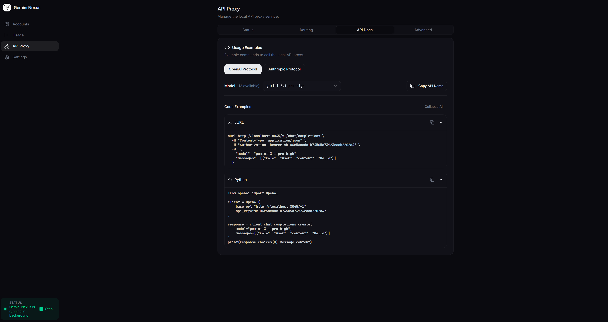
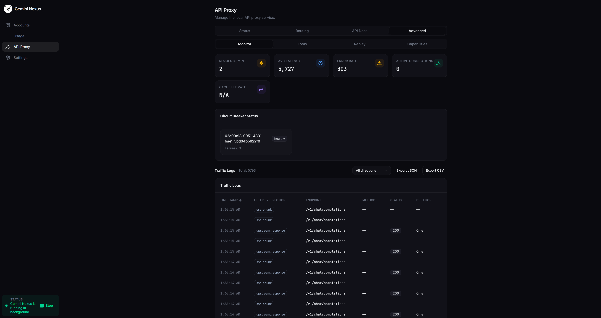
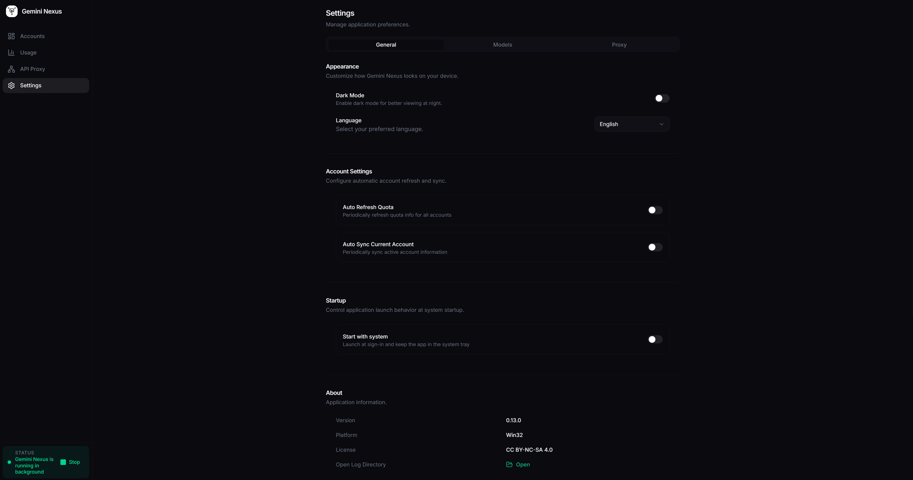

<p align="center">
  
</p>

<h1 align="center">Gemini Nexus</h1>

<p align="center">
  <strong>🚀 专业的多账户 AI 网关，支持 Google Gemini 和 Claude</strong>
</p>

<p align="center">
  <a href="README.md">English</a> | <a href="README.pt-BR.md">Português</a> | 中文 | <a href="README.es.md">Español</a>
</p>

<p align="center">
  <a href="https://github.com/evandrodevbr/GeminiNexus/releases">
    
  </a>
  <a href="https://github.com/evandrodevbr/GeminiNexus/releases">
    
  </a>
  <a href="https://github.com/evandrodevbr/GeminiNexus/blob/main/LICENSE">
    
  </a>
  
  
</p>

> [!IMPORTANT]
> **Windows 用户：** 如果在安装过程中看到 **“Windows 已保护你的电脑”** (SmartScreen) 警告，请点击 **“更多信息”** (More info)，然后点击 **“仍要运行”** (Run anyway)。这是未签名的新应用预期的安全提示，属于正常现象。

---

## 📖 目录

- [✨ 为什么选择 Gemini Nexus？](#-为什么选择-gemini-nexus)
- [🎯 功能特性](#-功能特性)
- [📸 截图](#-截图)
- [⚡ 安装与快速开始](#-安装与快速开始)
- [🛠️ 技术栈](#️-技术栈)
- [💻 开发](#-开发)
- [❓ 常见问题](#-常见问题)
- [🤝 参与贡献](#-参与贡献)
- [📄 许可证](#-许可证)

---

## ✨ 为什么选择 Gemini Nexus？

在使用 AI 驱动的 IDE 和编程工具时，你是否遇到过这些问题？

- 😫 **配额限制：** 单个账户配额很快用完，需要频繁手动切换。
- 🔄 **账户管理：** 管理多个 Google/Claude 账户非常繁琐。
- 📊 **盲目使用：** 不知道已经消耗了多少 Token 或还剩多少配额。
- 🔌 **集成问题：** 需要一个可靠的本地 API 代理，并且必须原生支持 OpenAI/Anthropic 协议。
- 🔍 **缺乏透明度：** 无法查看代理在后台实际发送或接收的数据。

**Gemini Nexus** 解决所有这些问题。它是一个专业的 Electron 桌面应用，作为你的开发工具和 Google Gemini / Claude AI 之间的智能网关。

### 核心价值主张

- ✅ **无限账户池** — 添加任意数量的 Google Gemini 和 Claude 账户。
- ✅ **智能自动切换** — 当配额不足或被限速时自动轮换到下一个可用账户。
- ✅ **实时使用分析** — SaaS 级仪表板，配备面积图、趋势指标和模型分布。
- ✅ **完整的代理可观测性** — 实时流量监控、请求重放和模型能力检查器。
- ✅ **兼容 OpenAI 和 Anthropic** — 即插即用的代理，支持 Cursor、Windsurf、OpenCode 以及任何兼容 OpenAI 的工具。
- ✅ **默认安全** — AES-256-GCM 加密，配合操作系统原生凭证管理。

---

## 🎯 功能特性

<table>
  <tr>
    <td width="50%">
      <h3>☁️ 云端账户池</h3>
      <ul>
        <li>通过 OAuth 添加无限量的 Google Gemini / Claude 账户</li>
        <li>显示头像、邮箱、状态和最后使用时间</li>
        <li>实时状态监控（活跃、限速、过期）</li>
        <li>每个账户可独立配置代理 URL</li>
        <li>设备身份档案管理及历史记录</li>
      </ul>
    </td>
    <td width="50%">
      <h3>📊 使用分析仪表板</h3>
      <ul>
        <li>实时 Token 消耗，每 15 秒自动刷新</li>
        <li>面积图展示每日/每小时的 Prompt 和 Completion Token</li>
        <li>趋势指标（与上一周期相比的百分比变化）</li>
        <li>统计卡片内嵌迷你折线图（Sparklines）</li>
        <li>水平柱状图展示模型分布排名</li>
        <li>Prompt/Completion 比例可视化</li>
      </ul>
    </td>
  </tr>
  <tr>
    <td width="50%">
      <h3>🔌 本地 API 代理（网关）</h3>
      <ul>
        <li>兼容 OpenAI <code>/v1/chat/completions</code></li>
        <li>兼容 Anthropic <code>/v1/messages</code></li>
        <li>完整的 SSE 流式传输支持（已在 Cursor, Windsurf, OpenCode 测试）</li>
        <li>模型映射（如 <code>claude-sonnet-4-6</code> → <code>gemini-3-flash</code>）</li>
        <li>可配置端口、超时时间和 API 密钥</li>
        <li>模型可见性控制（隐藏/显示特定模型）</li>
      </ul>
    </td>
    <td width="50%">
      <h3>🔄 智能自动切换</h3>
      <ul>
        <li>无限池模式，智能备份选择</li>
        <li>配额低于 5% 或被限速时自动切换</li>
        <li>每 5 分钟后台监控</li>
        <li>优雅降级，带状态原因追踪</li>
      </ul>
    </td>
  </tr>
  <tr>
    <td width="50%">
      <h3>🔍 代理可观测性（高级）</h3>
      <ul>
        <li><strong>流量监控</strong> — 实时请求/响应日志，含延迟和模型信息</li>
        <li><strong>请求重放</strong> — 重放任意请求进行调试</li>
        <li><strong>模型能力</strong> — 检查每个模型对视觉、思考、流式、JSON 模式的支持</li>
        <li><strong>开发者工具</strong> — cURL 和 Python 代码生成，一键复制</li>
      </ul>
    </td>
    <td width="50%">
      <h3>🔐 安全与加密</h3>
      <ul>
        <li>所有敏感数据采用 AES-256-GCM 加密</li>
        <li>集成操作系统原生凭证管理器 (Keytar + SafeStorage)</li>
        <li>自动迁移旧版明文数据</li>
        <li>每个账户的 Token 和配额均加密存储</li>
      </ul>
    </td>
  </tr>
  <tr>
    <td width="50%">
      <h3>⚙️ 设置与自定义</h3>
      <ul>
        <li>深色 / 浅色 / 跟随系统主题</li>
        <li>多语言：English & Português (Brasil)</li>
        <li>每个账户可独立覆盖代理 URL</li>
        <li>模型可见性开关</li>
        <li>日志目录访问</li>
      </ul>
    </td>
    <td width="50%">
      <h3>🖥️ 桌面体验</h3>
      <ul>
        <li>原生 Electron 应用，系统托盘集成</li>
        <li>可折叠侧边栏，状态持久化</li>
        <li>响应式布局适配所有视图</li>
        <li>状态栏实时显示代理和连接指标</li>
        <li>错误边界处理以及友好的用户提示</li>
      </ul>
    </td>
  </tr>
</table>

---

## 📸 截图

<p align="center">
  
</p>
<p align="center">
  
</p>
<p align="center">
  
</p>
<p align="center">
  
</p>
<p align="center">
  
</p>
<p align="center">
  
</p>
<p align="center">
  
</p>

---

## ⚡ 安装与快速开始

### 📦 下载

您可以从我们的 [Releases 页面](https://github.com/evandrodevbr/GeminiNexus/releases) 下载适用于 Windows、macOS 和 Linux 的最新预编译版本。

*(如果您使用的是 Windows 并在安装时遇到了 SmartScreen 提示，请参阅页面顶部的警告)。*

### 🔌 配合 AI IDE 使用

在代理运行并至少添加一个账户后，配置您首选的 IDE（Cursor、Windsurf、OpenCode 等）：

```plaintext
API Base URL:  http://localhost:10100/v1
API Key:       （从应用的 Proxy 页面复制）
Model:         gemini-3-flash （或您选择的任何映射模型）
```

### 🛠️ 从源码构建

#### 前置要求

- **Node.js** v20 或更高版本
- **npm** （本项目使用 `package-lock.json`）

#### 步骤

```bash
# 克隆仓库
git clone https://github.com/evandrodevbr/GeminiNexus.git
cd GeminiNexus

# 安装依赖
npm install

# 启动开发环境
npm start

# 构建生产版本（例如 Windows 安装程序）
npm run make
```

---

## 🛠️ 技术栈

| 分类       | 技术                                    |
| ---------- | --------------------------------------- |
| **核心**   | Electron, React 19, TypeScript          |
| **构建**   | Vite, Electron Forge                    |
| **样式**   | Tailwind CSS v4, Radix UI, Lucide Icons |
| **状态**   | TanStack Query, TanStack Router         |
| **后端**   | NestJS (内部网关), ORPC (类型安全 RPC)  |
| **数据库** | Better-SQLite3, Drizzle ORM             |
| **图表**   | Nivo (Line, Bar, Pie)                   |
| **测试**   | Vitest, Playwright                      |

---

## 💻 开发

```bash
# 启动开发环境 (Electron + Vite HMR)
npm start

# 运行代码规范检查
npm run lint

# 类型检查
npm run type-check

# 格式化代码
npm run format:write

# 运行测试
npm test
```

---

## ❓ 常见问题

<details>
<summary><b>问：安装时出现 Windows SmartScreen 警告（"Windows 已保护你的电脑"）？</b></summary>

是的，对于未签名的新应用，这是一个常见的警告。请点击 **"更多信息"** (More info)，然后点击 **"仍要运行"** (Run anyway)。详情请参阅 README 顶部的提示。
</details>

<details>
<summary><b>问：从源码构建时应用无法启动？</b></summary>

1. 确保所有依赖均已安装：`npm install`
2. 检查 Node.js 版本是否 >= 20。
3. 尝试删除 `node_modules` 并重新安装。
4. 在 Windows 上，请确保已安装 WiX Toolset 以便执行 `npm run make` 命令。
</details>

<details>
<summary><b>问：账户登录失败？</b></summary>

1. 确保您的网络连接正常。
2. 尝试清除应用数据并重新登录。
3. 检查该账户是否已被 Google/Claude 限制。
</details>

<details>
<summary><b>问：IDE 无法连接到代理？</b></summary>

1. 确保代理正在运行（查看状态栏的绿色指示器）。
2. 确认端口与您 IDE 中的配置一致（默认为 `10100`）。
3. 直接从 Proxy 页面复制 API 密钥并粘贴到 IDE 设置中。
4. 确保在 Accounts 页面中至少有一个活跃的账户。
</details>

<details>
<summary><b>问：Token 计数显示为零？</b></summary>

1. 这是早期版本中的一个已知漏洞 — 请更新至最新版本。
2. 目前 Token 追踪功能已能正确处理流式元数据及预估计数。
3. 使用数据会在 Usage Analytics 页面每 15 秒自动刷新。
</details>

---

## 🤝 参与贡献

欢迎贡献代码！详情请参阅 `CONTRIBUTING.md`。

---

## 📄 许可证

本项目采用双重许可结构：

- **原始代码**来自 [Draculabo](https://github.com/Draculabo) 的 [AntigravityManager](https://github.com/Draculabo/AntigravityManager)：采用 [CC BY-NC-SA 4.0](LICENSE) 许可。
- **所有新代码、功能和架构**由 [evandrodevbr](https://github.com/evandrodevbr) 开发：采用 [MIT 许可证](LICENSE-MIT)。

> 🔄 **迁移通知：** 本项目正在积极迁移到完全开源许可证（MIT）。随着剩余原始代码的逐步重写，整个项目将过渡到 MIT。我们致力于将 Gemini Nexus 打造为 100% 开源项目。

---

## 🙏 致谢

本项目最初是从 [Draculabo](https://github.com/Draculabo) 创建的 [AntigravityManager](https://github.com/Draculabo/AntigravityManager) 分支而来的。最初的代理概念和早期的 Electron 框架基于他的工作。

自从分支以来，[evandrodevbr](https://github.com/evandrodevbr) **重写、重新设计并扩展了绝大部分代码库**，包括但不限于：

- 完整的 UI/UX 重新设计（导航、账户、使用分析、代理管理）
- 使用分析仪表板，包含成本跟踪、Token 平均值以及 OpenRouter 集成
- 流量监视器，提供按请求查看的 Token/成本检查
- 环境隔离（dev/prod）、CI/CD 流水线和测试基础设施
- IDE 快速设置（OpenCode、Cursor、VS Code、Claude Code）
- 自定义模型定价配置
- 所有文档和国际化（EN, PT-BR, ES, ZH-CN）
